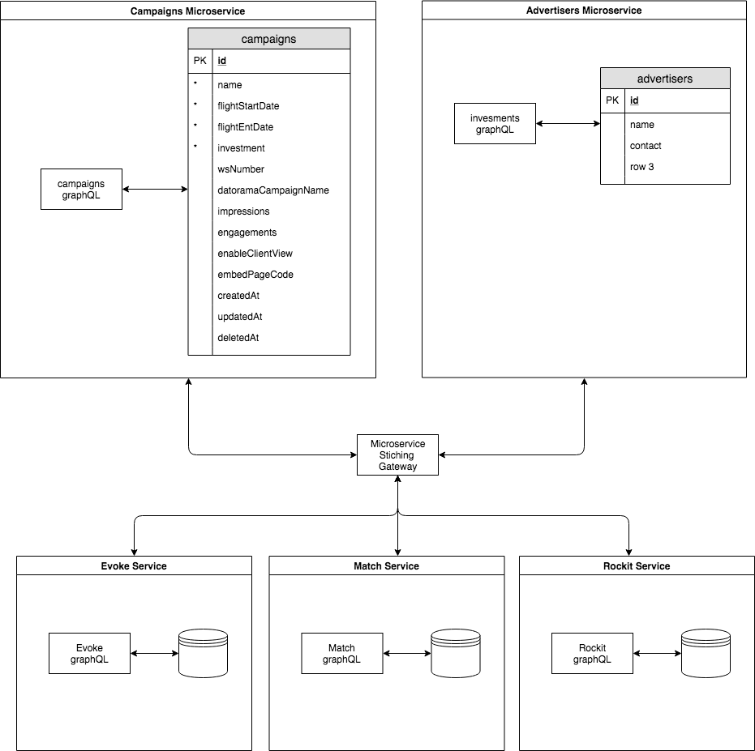

# Apollo GraphQL Stitching PoC



## Developer setup

1. Get [Docker](https://www.docker.com/get-started)
1. If you are on macOS, get [docker-sync](http://docker-sync.io/) for faster file
syncs and container IO. 
1. If using `docker-sync`, use `docker-sync start && docker-compose up` to start the local
development environment
1. run `./seed-db` 
1. Point your browser at http://localhost:3010

## Pure Docker Override

For a non `docker-sync` setup create the following `docker-compose.override.yml` file

```
version: '3'
services:
  # Campaigns micro-service
  campaigns:
    volumes:
      - ./campaigns:/app
      - /app/node_modules/

  gateway:
    volumes:
      - ./gateway:/app
      - /app/node_modules/

  evoke:
    volumes:
      - ./evoke:/app
      - /app/node_modules/

  # match service
  match:
    volumes:
      - ./match:/app
      - /app/node_modules/
```

## Problems to Solve / Things that can be improved

### Initial Campaigns Synching

Both [evoke](./evoke) and [match](./match) use Redis pub/sub to publish campaign create/update and deletes which services
can subscribe to. Although keeps existing data in sync between the [campaigns](./campaigns) microservice and API
consumers, it does not cater for loading all of the `campaigns` data into required shadow tables for new services.

Maybe one solution is to pull all `campaigns` from on service startup to sync shadow campaigns tables?

### Gateway Restarts
 
The gateway [needs to be restarted](https://spectrum.chat/apollo/apollo-federation/federated-schemas-changes-require-gateway-redeploy~4a839c03-4549-43df-975d-a6732c255707) 
whenever either the `campaigns` or `match` services are updated. 
[This](https://spectrum.chat/apollo/apollo-federation/handling-availability-and-timing~a5364199-1c5b-40c8-989d-f4cc31a7daf4) is another query
regarding this.

